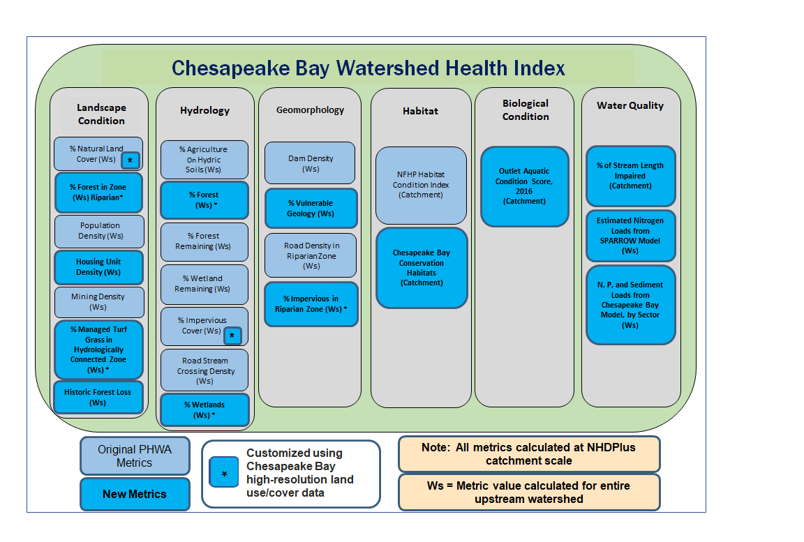
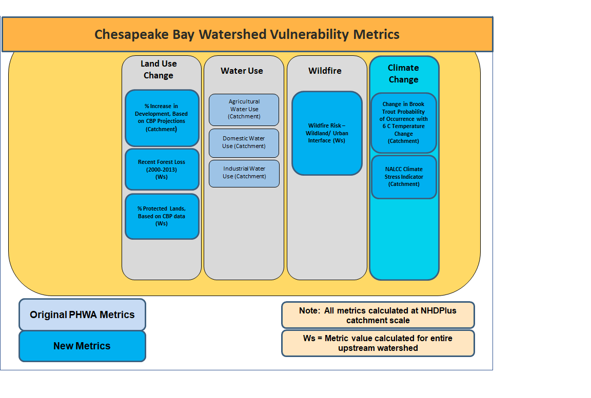

# SESYNC HEALTHY WATERSHED PROJECT 

Goal: *Add/update and evaluate a variable in the Chesapeake Healthy Watershed Assessment (CHWA).*

Variable: Percent forest cover 

Data: 

* Maryland Biological Stream Survey data attributed with numeric and categorical stream condition (point shapefile) 
* CHWA database (National Hydrologic Dataset (100K) catchments attributed with CHWA variables (CSV or polygon shapefile).  
* 2013 Tree Canopy for Maryland (1-meter raster) 

Process: 

 * Subset CHWA for Maryland 
 * Summarize (zonal) tree canopy area by NHD catchment and add/update attribute 
 * Optional-- Accumulate tree canopy area downstream (optional call to Sarah’s Python code) 
 * Add accumulate tree canopy area as a new attribute to CHWA database 
 * Relate/join MBSS point ID to NHD+ COMID 
 * Regress subset of CHWA metrics, including new one, against MBSS condition 
 * Metrics vs MBSS numeric 
 * Metrics vs MBSS categorical 
 * Visualize regression results 
 * Evaluate regression results and report pass/fail based on user  defined significance threshold 
 * If pass- commit changes to CHWA (aka NHD database), if fail- don’t commit changes to CHWA
 * Add QAQC steps

[CONTRIBUTING.md]: CONTRIBUTING.md

## Collaborators
- Renee Thompson, USGS
- Peter Claggett, USGS
- Sarah McDonald, USGS
- Labeeb Ahmed, Attain LLC

# SESYNC Healthy Watersheds Final Presentation

## Background on Chesapeake Healthy Watersheds Assessment

The Chesapeake Bay Program, through its *_Maintain Healthy Watersheds Goal Implementation Team_*, has
a goal of maintaining the long-term health of watersheds identified as healthy by its partner jurisdictions.
Quantitative indicators are important to _assess current watershed condition, track future condition, and
assess the vulnerability_ of these state-identified watersheds to future degradation. 

https://www.chesapeakebay.net/channel_files/26540/chesapeake_healthy_watersheds_assessment_report.pdf

## Process for 
1. Spatially join the healthy watersheds metrics to the MBSS point data
    chwa_mbss <- st_join(mbss, chwa)
    
2. Buffer the MBSS points by 100 meters
    mbss_100 <- chwa_mbss %>%  st_buffer(100)
    
    (Insert buffer png)
    
 3. Read in land cover raster containing forest and impervious classes
    LC <- raster("LC_MD_5m.tif")

4. Calculate Percent Forest and Percent Impervious cover within the 100m buffers
    aggLC <- extract(LC, mbss_100)
    pctForest <- rep(0, length(aggLC))
    pctImp <- rep(0, length(aggLC))
    for(row in 1:length(aggLC)){tb <- as.data.frame(table(aggLC[row]))
      forest <- tb[tb == 1, 'Freq']
      imp <- tb[tb == 2, 'Freq'] #(tb[tb == 5, 'Freq'] + tb[tb == 6, 'Freq'])
      if (length(forest) != 0){
        pctForest[row] <- forest / length(aggLC[[row]]) #percent forested}
      if (length(imp) != 0){
        pctImp[row] <- imp / length(aggLC[[row]])  # percent impervious } }

 (insert red dot in forest png)
 
 5. Add newly calculated data to the joined data
    chwa_mbss <- as.data.frame(chwa_mbss)
    chwa_mbss['BUFPctFor'] <- pctForest
    chwa_mbss['BUFPctImp'] <- pctImp

Reproducible pipeline 

##Can you aquire data programatically?
  *Yes and No*
    - some data is available through Maryland iMap online, Chesapeake Open Data
    - some data was privided manually through a data agreemnet
    
Discuss the final steps of your reproducible pipeline. Should you create a data package?
Try to get that regression model working or finish that data visualization.
Prepare to present on your mini-project!

