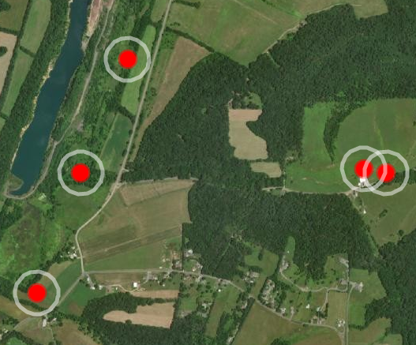

# SESYNC HEALTHY WATERSHED PROJECT 

##Goals:
* ### Improve git and R skills
* ### Improve group collaboration skills
* ### Develop reproducible workflows to add/update and evaluate variables to the Chesapeake Healthy Watershed Assessment (CHWA)

Variable: Percent forest cover 

Data: 

* Maryland Biological Stream Survey data attributed with numeric and categorical stream condition (point shapefile) 
* CHWA database (National Hydrologic Dataset (100K) catchments attributed with CHWA variables (CSV or polygon shapefile).  
* 2013 Tree Canopy for Maryland (1-meter raster) 

Initial workflow: 

 * Subset CHWA for Maryland 
 * Summarize (zonal) tree canopy area by NHD catchment and add/update attribute 
 * Optional-- Accumulate tree canopy area downstream (optional call to Sarah’s Python code) 
 * Add accumulate tree canopy area as a new attribute to CHWA database 
 * Relate/join MBSS point ID to NHD+ COMID 
 * Regress subset of CHWA metrics, including new one, against MBSS condition 
 * Metrics vs MBSS numeric 
 * Metrics vs MBSS categorical 
 * Visualize regression results 
 * Evaluate regression results and report pass/fail based on user  defined significance threshold 
 * If pass- commit changes to CHWA (aka NHD database), if fail- don’t commit changes to CHWA
 * Add QAQC steps

## Collaborators
- Renee Thompson, USGS
- Peter Claggett, USGS
- Sarah McDonald, USGS
- Labeeb Ahmed, Attain LLC

---

# SESYNC Healthy Watersheds Final Presentation

### Background on Chesapeake Healthy Watersheds Assessment

The Chesapeake Bay Program, through its *_Maintain Healthy Watersheds Goal Implementation Team_*, has
a goal of maintaining the long-term health of watersheds identified as healthy by its partner jurisdictions.
Quantitative indicators are important to _assess current watershed condition, track future condition, and
assess the vulnerability_ of these state-identified watersheds to future degradation. 

[Chesapeake Healthy Watershed Assessment report](https://www.chesapeakebay.net/channel_files/26540/chesapeake_healthy_watersheds_assessment_report.pdf)

Reproducible pipeline 

### Can you aquire data programatically?*Yes and No*
  - some data is available through Maryland iMap online, Chesapeake Open Data
  - some data was provided manually through a data agreemnet
    
Discuss the final steps of your reproducible pipeline. Should you create a data package?
Try to get that regression model working or finish that data visualization.
Prepare to present on your mini-project!

### Workflow for adding/updating and evaluating variable(s) into CHWA Assessment: 
1. Spatially join the healthy watersheds metrics to the MBSS point data
    
        chwa_mbss <- st_join(mbss, chwa)
    
2. Buffer the MBSS points by 100 meters

        mbss_100 <- chwa_mbss %>%  st_buffer(100)
    
    

 3. Read in land cover raster containing forest and impervious classes

        LC <- raster("LC_MD_5m.tif")

4. Calculate Percent Forest and Percent Impervious cover within the 100m buffers

        aggLC <- extract(LC, mbss_100)
        
        pctForest <- rep(0, length(aggLC))
        
        pctImp <- rep(0, length(aggLC))
        
        for(row in 1:length(aggLC)){tb <- as.data.frame(table(aggLC[row]))
          forest <- tb[tb == 1, 'Freq']
          imp <- tb[tb == 2, 'Freq'] #(tb[tb == 5, 'Freq'] + tb[tb == 6, 'Freq'])
          if (length(forest) != 0){
            pctForest[row] <- forest / length(aggLC[[row]]) #percent forested}
          if (length(imp) != 0){
            pctImp[row] <- imp / length(aggLC[[row]])  # percent impervious } }

    
 
 5. Add newly calculated data to the joined data
 
        chwa_mbss <- as.data.frame(chwa_mbss)
        chwa_mbss['BUFPctFor'] <- pctForest
        chwa_mbss['BUFPctImp'] <- pctImp

**Leaflet maps**
[Visualizing ](https://lahm3d.github.io/sesync_healthy_watersheds/100m_buffers.html)
[Visualizing percent forest buffer](https://lahm3d.github.io/sesync_healthy_watersheds/)

6. Clean and fix column names

7. Filter and exclude catchments with missing data

8. Rank multiple data points within each catchment by year to use as weights

9. Group-by and calculate weighted means

10. Perform linear regression and step-wise regression

*Benthic IBI*:
                       Estimate Std. Error t value Pr(>|t|)    
        (Intercept)   2.415e+00  3.463e-01   6.975 4.28e-12 ***
        PctNatural   -1.605e+00  3.953e-01  -4.060 5.12e-05 ***
        Mngd_TF_HCZ  -8.109e-01  2.116e-01  -3.833 0.000131 ***
        PctForeWshed  2.436e+00  3.140e-01   7.758 1.43e-14 ***
        PctImpWshed  -4.177e+00  6.678e-01  -6.255 4.94e-10 ***
        HabConditi    1.188e-01  3.484e-02   3.409 0.000667 ***
        SPARROWTN    -9.723e+01  2.135e+01  -4.555 5.59e-06 ***
        SPARROWTP     6.522e+01  7.648e+00   8.528  < 2e-16 ***
        CBP_Ag_N      6.705e+01  1.406e+01   4.770 1.99e-06 ***
        BUFPctFor     5.819e-01  8.689e-02   6.697 2.83e-11 ***
        
        Multiple R-squared:  0.2943,    Adjusted R-squared:  0.2846 

*Fish IBI*:
                       Estimate Std. Error t value Pr(>|t|)    
        (Intercept)     3.92367    0.25772  15.225  < 2e-16 ***
        PctNatural     -3.13719    0.48225  -6.505 1.01e-10 ***
        PctForeWshed    1.46428    0.42876   3.415 0.000652 ***
        PctImpWshed    -3.15918    0.68925  -4.584 4.90e-06 ***
        RoadStream     -0.15386    0.04157  -3.701 0.000222 ***
        CBP_Ag_P      202.00419   29.70632   6.800 1.43e-11 ***
        CBP_WW_S     -140.51963   34.18429  -4.111 4.13e-05 ***
        BUFPctFor       0.50275    0.11679   4.305 1.76e-05 ***

        Multiple R-squared:  0.1129,    Adjusted R-squared:  0.1048

### Lessons learned:
* GITHUB, R, and SLACK work great for collaborative coding and managing coding projects
* Project demonstrated the importance of understanding and exploring data initially- something R is very good at
* Important to request code for all outsourced geospatial projects
### Future:
* Need to find a way to better manage code from disparate projects
* Need a key for navigating statistical options in R
* Will apply collaborative approach taught in this workshop to future geospatial analysis projects